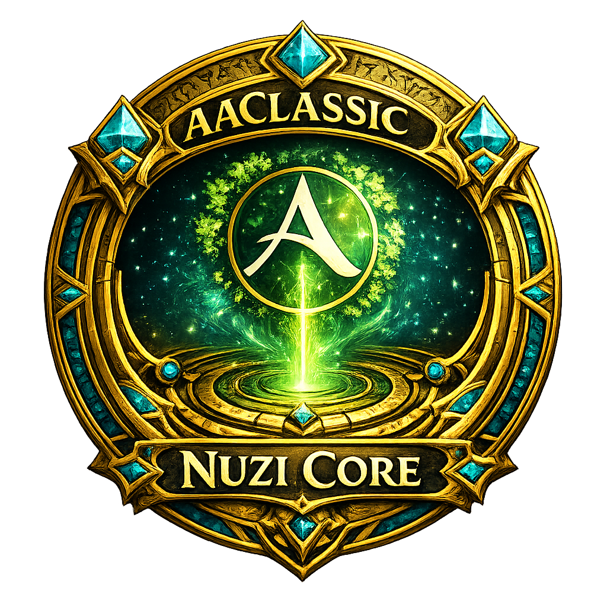

# Nuzi Core

<p align="center">
  
</p>

`nuzi-core` is a shared runtime library for ArcheAge Classic addons.

It packages the boring but necessary parts of addon work into one reusable dependency:

- safe module loading
- prefixed logging
- managed event registration and cleanup
- local chat command routing
- persistent settings stores
- backup and profile helpers
- throttled update loops
- render signature gates
- shared UI widgets and window positioning helpers

`nuzi-core` is a library, not a standalone UI addon.

## Install

If you publish through Classic Addon Manager, declare `nuzi-core` as a dependency in your addon manifest:

```yaml
name: my-addon
alias: My Addon
dependencies: ['nuzi-core']
description: Example addon using nuzi-core.
author: You
repo: yourname/my-addon
branch: main
tags: ["Utility"]
```

If you install manually:

1. Put the `nuzi-core` folder next to your addon folder.
2. Make sure `nuzi-core` loads before your addon in `addons.txt`.

When loaded, `nuzi-core` attaches the shared surface at:

```lua
api._NuziCore
```

## Quick Start

Most addons only need a few modules to get moving:

```lua
local api = require("api")
local Core = api._NuziCore or require("nuzi-core/core")

local Log = Core.Log
local Events = Core.Events
local Settings = Core.Settings
local Scheduler = Core.Scheduler

local addon = {
    name = "My Addon",
    author = "You",
    version = "1.0.0",
    desc = "Example addon using nuzi-core"
}

local logger = Log.Create(addon.name)
local events = Events.Create({ logger = logger })
local store = Settings.CreateStore({
    addon_id = "my-addon",
    settings_file_path = "my-addon/.data/settings.txt",
    legacy_settings_file_path = "my-addon/settings.txt",
    defaults = {
        enabled = true,
        window_x = 200,
        window_y = 200
    },
    read_mode = "serialized_then_flat",
    write_mode = "serialized_then_flat",
    read_raw_text_fallback = true
})

local ticker = Scheduler.CreateTicker({
    interval_ms = 100,
    max_elapsed_ms = 1000
})

function addon.OnLoad()
    store:Ensure()

    events:OnSafe("UPDATE", "update loop", function(dt)
        ticker:Run(dt, nil, function()
            local settings = store:Ensure()
            if settings.enabled then
                logger:Debug("tick")
            end
        end)
    end)
end

function addon.OnUnload()
    events:ClearAll()
end

return addon
```

## Common Patterns

### Settings

Use `CreateStore` when you want full control over paths, defaults, backup files, or profiles.

```lua
local store = Settings.CreateStore({
    addon_id = "my-addon",
    settings_file_path = "my-addon/.data/settings.txt",
    legacy_settings_file_path = "my-addon/settings.txt",
    defaults = {
        enabled = true,
        scale = 1,
        window_x = 300,
        window_y = 200
    }
})

local settings = store:Ensure()
settings.scale = 1.15
store:Save()
```

If your addon already uses a constants table, `CreateAddonStore` is the shorter option:

```lua
local Constants = {
    ADDON_ID = "my-addon",
    ADDON_NAME = "My Addon",
    SETTINGS_FILE_PATH = "my-addon/.data/settings.txt",
    LEGACY_SETTINGS_FILE_PATH = "my-addon/settings.txt",
    DEFAULT_SETTINGS = {
        enabled = true
    }
}

local store = Settings.CreateAddonStore(Constants, {
    read_mode = "serialized_then_flat",
    write_mode = "serialized_then_flat"
})
```

### Events

Use `Events.Create` for the addon API's global event bus. In the current client, that bus receives:

- `UPDATE`
- `CHAT_MESSAGE`
- `TEAM_MEMBERS_CHANGED`
- `UI_RELOADED`
- `UPDATE_PING_INFO`
- custom addon emits such as `raid_role_changed` and `ShowPopUp`

`Off` and `ClearAll` stop callbacks registered through the Core event helper. The client does not expose a true unsubscribe for `api.On`, so Core keeps one dispatcher per event and manages its own handler list.

For client events that are not on the global bus, use a private event window:

```lua
local inventoryEvents = Events.CreateEventWindow({
    id = "myAddonInventoryEvents",
    logger = logger
})

inventoryEvents:OnSafe("BAG_UPDATE", "bag update", function(...)
    RefreshBag(...)
end)

inventoryEvents:OnSafe("BANK_UPDATE", "bank update", function(...)
    RefreshBank(...)
end)

function addon.OnUnload()
    events:ClearAll()
    inventoryEvents:ClearAll()
end
```

Core rejects client-blocked private events such as `HOUSE_TAX_INFO`, `UNIT_ENTERED_SIGHT`, and `UNIT_LEAVED_SIGHT` instead of marking them as registered.

### Update Loops

Use `CreateTicker` to throttle `UPDATE` events without carrying your own elapsed accumulator:

```lua
local ticker = Scheduler.CreateTicker({
    interval_ms = 250,
    max_elapsed_ms = 1000
})

events:OnSafe("UPDATE", "refresh", function(dt)
    ticker:Run(dt, nil, function(elapsedMs)
        RefreshUi(elapsedMs)
    end)
end)
```

Use `CreateMultiLoop` when one addon needs separate hot and cold loops:

```lua
local loops = Scheduler.CreateMultiLoop({
    loops = {
        hot = {
            interval_ms = 33,
            callback = function(elapsedMs)
                UpdateVisibleFrames(elapsedMs)
            end
        },
        cold = {
            interval_ms = 250,
            callback = function(elapsedMs)
                RebuildCaches(elapsedMs)
            end
        }
    }
})

events:OnSafe("UPDATE", "multi loop", function(dt)
    loops:Tick(dt)
end)
```

### Commands

`Commands.CreateRouter` handles chat payload parsing and local-player filtering:

```lua
local router = Core.Commands.CreateRouter({
    logger = logger,
    get_player_name = function()
        return "PlayerName"
    end
})

router:Add("!myaddon", function(ctx)
    logger:Info("command args: " .. tostring(ctx.rest))
end)

events:OptionalOnSafe("CHAT_MESSAGE", "chat command", function(...)
    router:Handle(...)
end)
```

### Window Position Persistence

`Core.UI.Positioning.CreateNamedPositionManager` handles saved anchors and drag persistence:

```lua
local positions = Core.UI.Positioning.CreateNamedPositionManager({
    get_settings = function()
        return store:Ensure()
    end,
    save_settings = function()
        store:Save()
    end,
    mappings = {
        window = { x = "window_x", y = "window_y" }
    },
    require_shift = true
})

positions:ApplyAndBind(window, nil, "window")
```

That applies the saved position and binds dragging in one call. With `require_shift = true`, the window only drags while shift is held.

Position saves use anchor-space `GetOffset()` by default so different UI scales do not drift. Use `prefer_effective_offset = true` only when a window intentionally stores scaled screen coordinates.

## Modules

- `nuzi-core/core`: full shared surface
- `nuzi-core/require`: safe require helpers and candidate loading
- `nuzi-core/runtime`: trim, clamp, merge, deep-copy, path, and delta helpers
- `nuzi-core/log`: logger factory with `Try` and `Wrap`
- `nuzi-core/events`: managed event registration and cleanup
- `nuzi-core/commands`: chat payload parsing and command routing
- `nuzi-core/render`: render signature gates
- `nuzi-core/actions`: reusable toggle and setting action helpers
- `nuzi-core/settings`: settings stores, backups, and profiles
- `nuzi-core/scheduler`: tickers and multi-loop schedulers
- `nuzi-core/ui/*`: widget helpers and positioning helpers
- `nuzi-core/util/*`: shared utility helpers

## Credits

Original AddonLibrary UI widget and Base64 pieces were created by Misosoup and contributors. Those pieces were carried forward here with credit while the shared runtime moved into `nuzi-core`.
